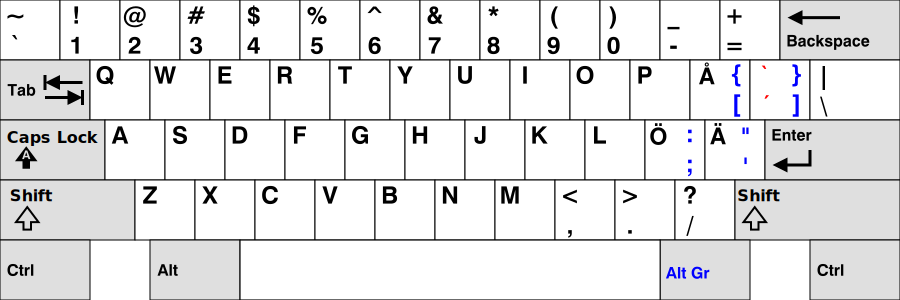
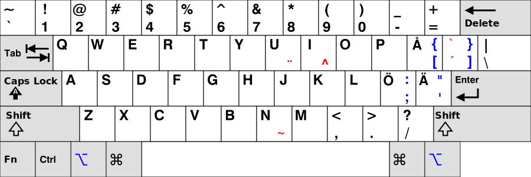
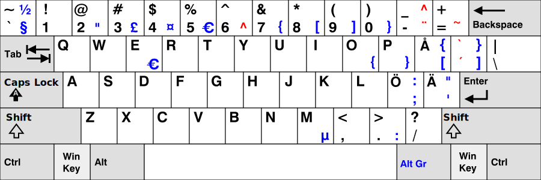
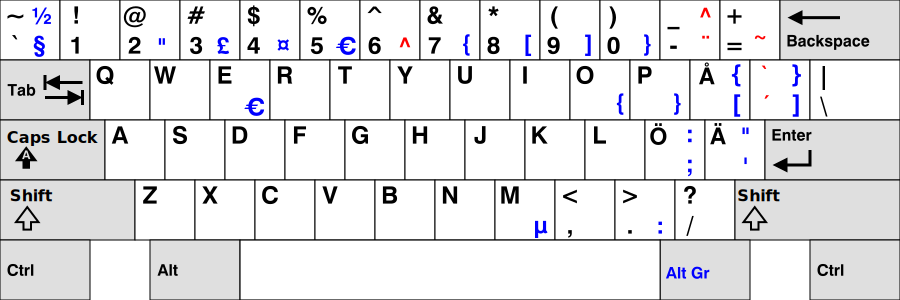

# SWERTY:sweden::cowboy_hat_face:

A Swedish keyboard layout for US keyboards.

(This repo is a mirror of [http://johanegustafsson.net/projects/swerty](http://johanegustafsson.net/projects/swerty/). Big thanks to Johan E. Gustafsson for creating this layout.)

## Swerty basic

The idea is to retain most of the US layout, but to have the keys **Å**, **Ä**, and **Ö** in their same positions as in the standard Swedish layout, replacing the ;, ', and [ keys in the US layout. The ] key is replaced by a dead key for acute and grave accents. The replaced keys from the US layout are reached by pressing **Alt Gr** and the original key. This basic layout has been altered somewhat in order to suit Mac, Linux, and Windows environments.

### :white_check_mark:For the expat:us:
The Swerty Keyboard Layout is a software keyboard layout for efficient typing in Swedish on US keyboards. 

The design goal for the Swerty layout is to retain as much as possible of the standard US layout (also known as the ANSI keyboard layout), while adding the keys **Å**, **Ä**, and **Ö** from the standard Swedish layout. 

This alternative software layout is especially useful if you are working on a US keyboard and want to write in Swedish.

### :white_check_mark:For the programmer:sunglasses::computer:
Arguably, Swerty is a better choice than the standard Swedish layout even if you are working on a Swedish keyboard, as it incorporates more of the superior key arrangement of the US layout. 

With the standard Swedish layout, many frequently used symbols are surprisingly inconvenient to type, such as **@** in email addresses, / in web addresses, and **$** in programming. These conventions were set by people who used the US layout where these symbols can be typed conveniently. The Swerty layout makes it possible to enjoy this convenience while typing in Swedish.

### :white_check_mark:For the Swedish keyboard enthusiast:keyboard:
Swerty enables Swedish speaker to use the superior ANSI keyboard layout. As ANSI is the most common layout in the US market, the supply is significantly wider and cheaper, if you are looking to buy a mechanical or a vintage keyboard.


___
## Swerty for Mac


### Mac Wget Intall
(Tested on Snow Leopard, Lion, Mountain Lion, Mavericks, Yosemite, Sierra, Mojave, Catalina)

1. Copy/paste this command into your Terminal.app and press enter to run.
```
wget https://raw.githubusercontent.com/rubensz/swerty/master/Swerty.keylayout -o ~/Library/Keyboard\ Layouts && wget https://raw.githubusercontent.com/rubensz/swerty/master/Swerty.icns -o ~/Library/Keyboard\ Layouts
```
2. Restart your computer.
3. Go into System Preferences/Keyboard/Input Sources, hit the plus sign and add Swerty.
4. Select Swerty as your Input Source. 

#### Mac Manual Install
1. Download the files `Swerty.keylayout` and `Swerty.icns` from the repo. 
2. Move the files to the folder ‘~/Library/Keyboard Layouts’.
3. Restart your computer.
4. Go into System Preferences/Keyboard/Input Sources, hit the plus sign and add Swerty.
5. Select Swerty as your Input Source. 
### Swerty for Windows


#### Install Swerty for Windows
(Tested on XP, Vista, and 7)
Download [Swerty-win.zip](swerty-win.zip) from the repo, uncompress the zip-file and run ‘setup.exe’.

If you need to modify Swerty for Windows, you can do so by editing ‘Swerty.klc’ with Microsoft Keyboard Layout Creator.

## Swerty for Ubuntu


Download Swerty for Linux

(Tested on Ubuntu 9.04, 9.10, 10.04, and 12.04, 20.04, 22.04)

Download [swerty-ubuntu](swerty-ubuntu) and run ```sudo ./install.sh```

### Manual install
To install manually for Ubuntu, download [swerty-linux.tar.gz](swerty-linux.tar.gz) uncompress the tar.gz-file and follow ‘instructions.txt’.
